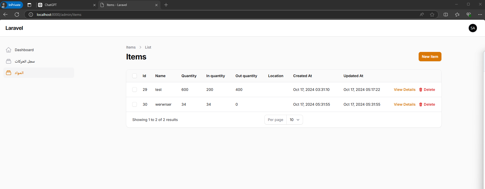
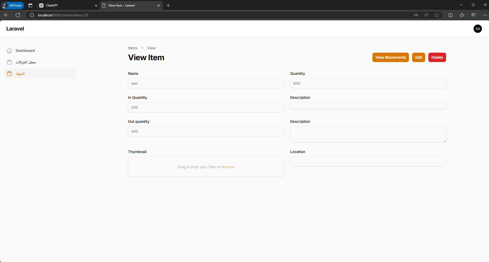
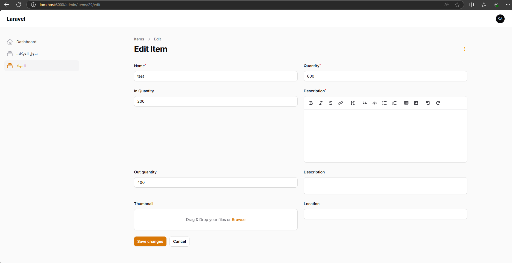
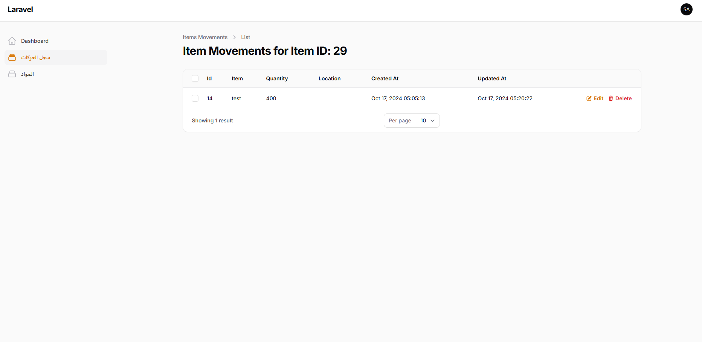
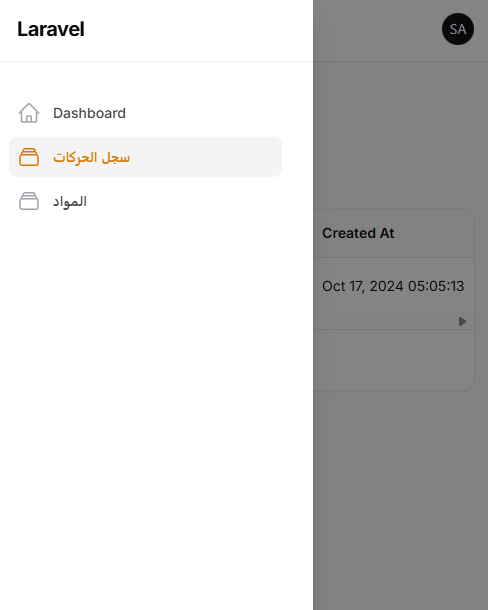
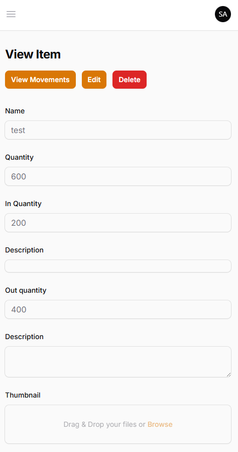
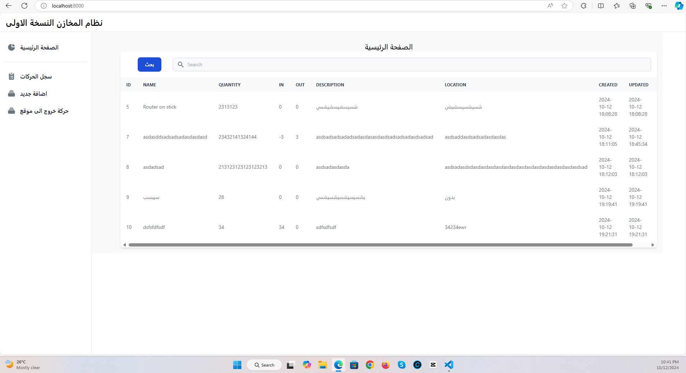
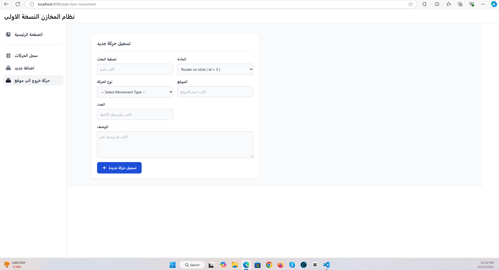
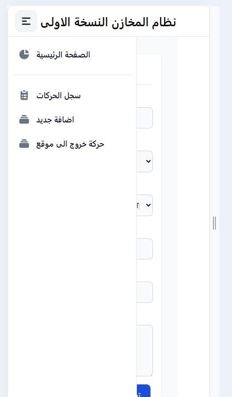
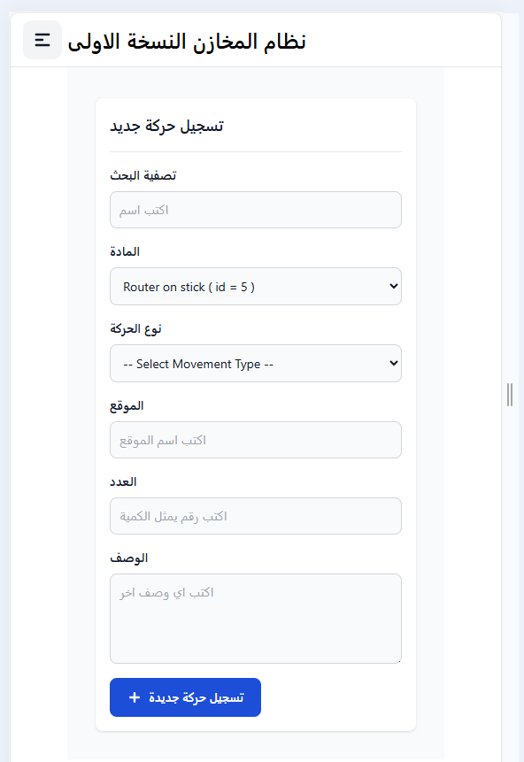

# نظام المخازن العالمي

مشروع بسيط  كامل بكل المميزات الخاصيات بنظام المخازن البسيط العالمي

تم بناء و تصميم الموقع حسب الطلب و تم استخدام الميزات التي تم طلبها

- اضافة منتجات جديدة الى المخازن
- نقل المنتجات من المخازن لموقع العمل
- اعادة تسجيل دخول المنتجات التي عادت من منطقة العمل

بالاعتماد الى اسلوب الحركات لتوثيق الكميات و المواد و الموقع الذي ذهبت اليه و الفترة و الكثير من التفاصيل

النسخة الاولى المحدثة:

النسخة الاولى:

